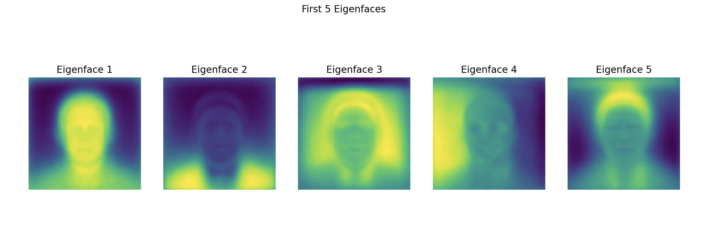
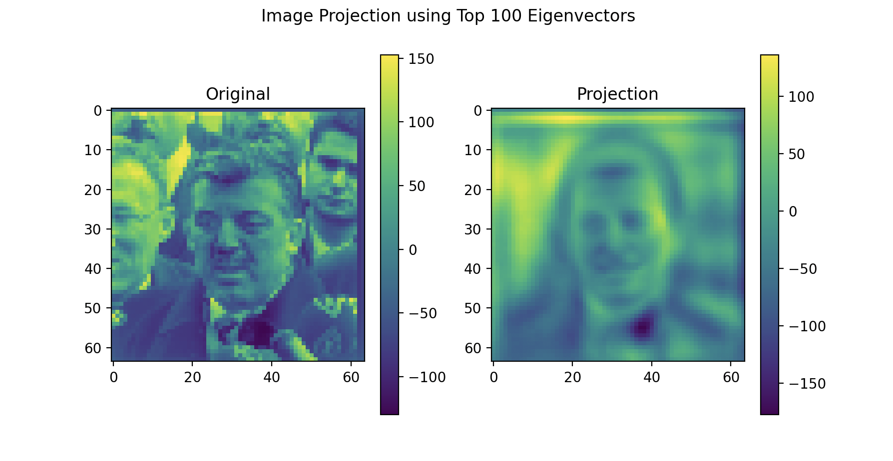
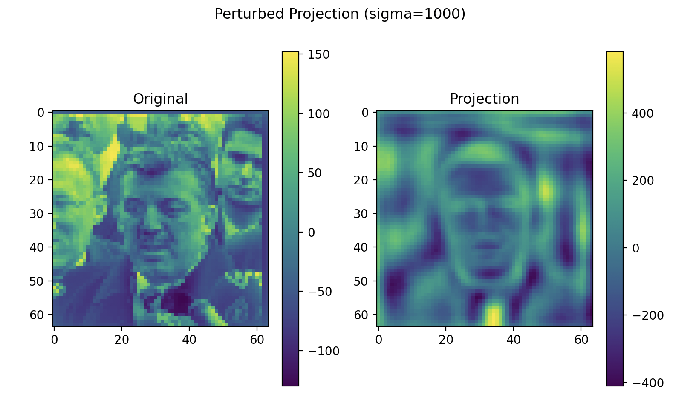
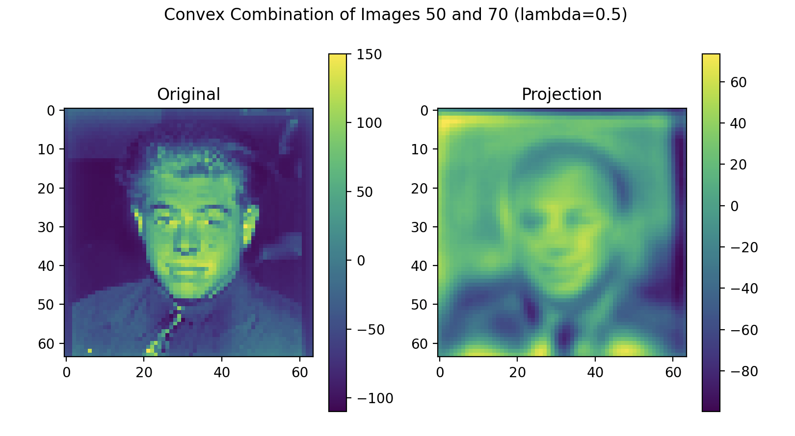

# PCA Eigenfaces

A facial recognition implementation using Principal Component Analysis (PCA) to generate Eigenfaces, a technique for dimensionality reduction in facial recognition systems.

## Overview

This project implements PCA for facial image processing, allowing for:
- Face representation using principal components (Eigenfaces)
- Image projection and reconstruction
- Face perturbation and combination capabilities


*The first 5 eigenfaces representing the principal components of facial variation*

## Requirements

The following Python packages are required:
- NumPy
- SciPy
- Matplotlib

## Setup

Create and activate a virtual environment:

```bash
python3 -m venv venv
source venv/bin/activate  # On Windows: venv\Scripts\activate
```

Install dependencies:

```bash
pip install numpy scipy matplotlib
```

## Usage

The main script to run is `pca_face_usage.py`:

```bash
python pca_face_usage.py
```

## Core Functionality

The `pca_face.py` module provides the following functions:

- `load_and_center_dataset(filename)`: Loads the face dataset and centers it
- `get_covariance(dataset)`: Computes the covariance matrix of the dataset
- `get_eig(S, k)`: Gets the k largest eigenvalues and corresponding eigenvectors
- `get_eig_prop(S, prop)`: Selects eigenvalues and eigenvectors based on explained variance
- `project_image(image, U)`: Projects an image onto the eigenspace
- `display_image(orig, proj)`: Displays original and projected images side by side
- `perturb_image(image, U, sigma)`: Adds Gaussian noise to an image in eigenspace
- `combine_image(image1, image2, U, lam)`: Creates a weighted combination of two faces

## Dataset

The project uses a dataset of face images stored in `face_dataset.npy`. Each face is represented as a 64×64 pixel grayscale image.

## Visualizations

### Eigenfaces

The top 100 eigenvectors capture the most significant facial variations in the dataset:


*Visualization of the top 100 eigenvectors (eigenfaces)*

### Face Perturbation

The system can generate variations of faces by adding controlled noise to the eigenspace representation:


*Original face image with perturbed projections showing variation through noise*

### Face Combination

The system can also create new face images by combining two faces with varying weights:


*Convex combination of faces 50 and 70 with different weighting factors*
